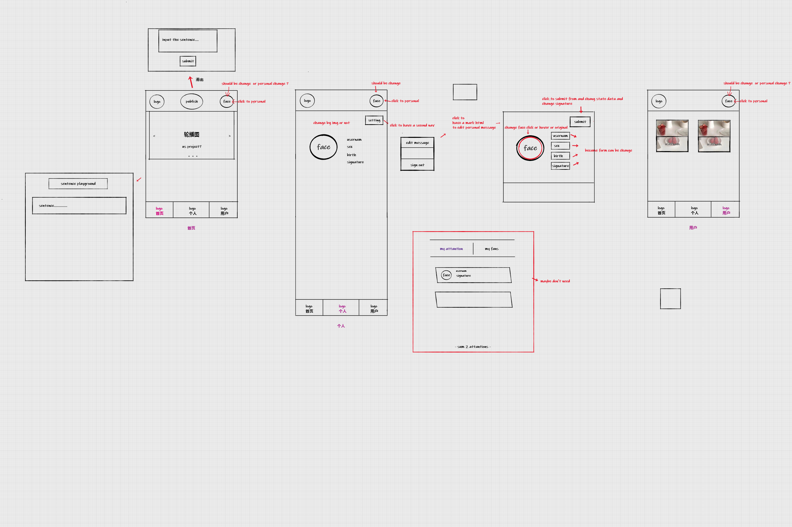

# vuedemo2

> A Vue.js project

学习完 vue 后 为了对vue的一些操作更加熟悉 而做的demo 里面有涉及到的操作有 ：

+ 基础语法 
+ 生命周期
+ 组件
+ 组件通信
+ 路由
+ vuex


项目的设计图 如下：



## Build Setup

``` bash
# install dependencies
npm install

# serve with hot reload at localhost:8080
npm run dev

# build for production with minification
npm run build

# build for production and view the bundle analyzer report
npm run build --report

# run unit tests
npm run unit

# run all tests
npm test
```

For a detailed explanation on how things work, check out the [guide](http://vuejs-templates.github.io/webpack/) and [docs for vue-loader](http://vuejs.github.io/vue-loader).
